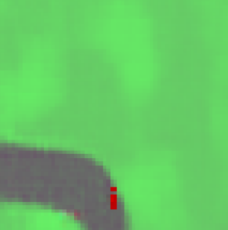

# Dropout's Dream Land
Implementation of Dropout's Dream Land in TensorFlow 2.

## Docker
The easiest way to handle dependencies is with [Nvidia-Docker](https://github.com/NVIDIA/nvidia-docker). Follow the instructions below to generate and attach to the container.
```
docker image build -t ddl:1.0 -f docker/Dockerfile.ddl .
docker container run -p 8888:8888 --gpus '"device=0"' --detach -it --name ddl ddl:1.0
docker attach ddl 
```

## Visualizations
To visualize the environment from the agents perspective or generate synthetic observations use the [visualizations jupyter notebook](WorldModels/visualizations.ipynb). It can be launched from your container with the following:
```
jupyter notebook --no-browser --port=8888 --ip=0.0.0.0 --allow-root
```

Sample of a real frame.


Reconstruction of the real frame. This can be thought of as what the agent sees.



This is an entirely imagined frame that never existed.


CarRacing gifs showing the true trajectory (left) and the reconstructed trajectory (right). 
Ground Truth             |  Reconstructed
:-------------------------:|:-------------------------:
 | 

Doom gifs showing a trajectory in the true environment (left) and the dream environment (right). 
Ground Truth Environment   |  Dream Environment
:-------------------------:|:-------------------------:
 | 

## Reproducing Results From Scratch
These instructions assume a machine with a 64 core cpu and a gpu. If running in the cloud it will likely financially make more sense to run the extraction and controller processes on a cpu machine and the VAE, preprocessing, and RNN tasks on a GPU machine.

### DoomTakeCover-v0
To reproduce the DoomTakeCover results run the following bash script
```
bash launch_scripts/ddl_doom_experiment.bash
```

### CarRacing-v0
To reproduce the CarRacing results run the following bash script
```
bash launch_scripts/ddl_carracing_fixed_n_experiment.bash
```

## Citation
```
@inproceedings{wellmer2021ddl,
  title={Dropout's Dream Land: Generalization from Learned Simulators to Reality},
  author={Wellmer, Zac and Kwok, James T},
  booktitle={Joint European Conference on Machine Learning and Knowledge Discovery in Databases},
  year={2021},
  organization={Springer}
}
```
